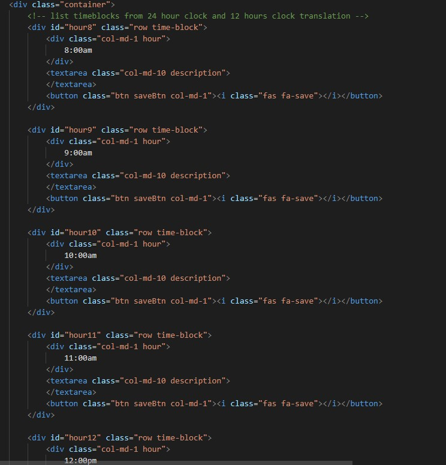
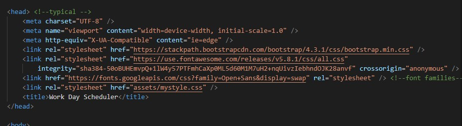
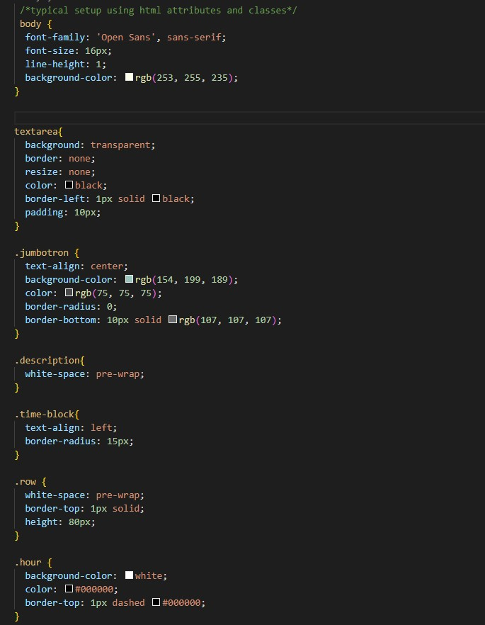
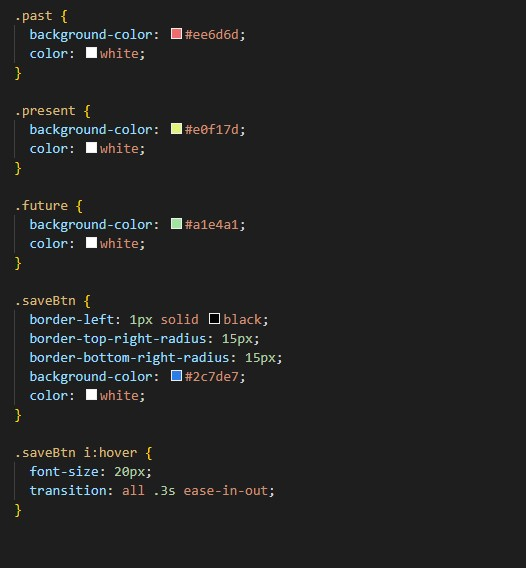
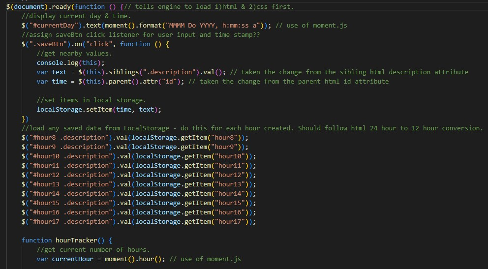
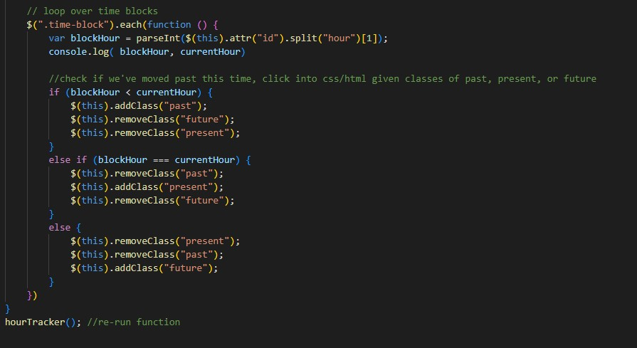

# WELCOME TO TRYING TO BE MORE ORGANIZED!
```
In this challenage we will be working on creating a daily work schdule. 
Because who doesn't want to try and be more organaized? I will be making
time blocks that will changed colors basied on what time it is. It wll 
also have a clock and date running to match what time and day it is.
```
## User Story 
```
AS AN employee with a busy schedule
I WANT to add important events to a daily planner
SO THAT I can manage my time effectively
```
## Acceptance Criteria
```
GIVEN I am using a daily planner to create a schedule
WHEN I open the planner
THEN the current day is displayed at the top of the calendar
WHEN I scroll down
THEN I am presented with time blocks for standard business hours
WHEN I view the time blocks for that day
THEN each time block is color-coded to indicate whether it is in the past, present, or future
WHEN I click into a time block
THEN I can enter an event
WHEN I click the save button for that time block
THEN the text for that event is saved in local storage
WHEN I refresh the page
THEN the saved events persist
```
#
## We start with the HTML file.
```
Here I created some basic time blocks to start off with. I used the same code for each hour that will be displayed. 
```

```
For this challenage we will be using bootstrap, mixed with some google font which i linked above my CSS in my HTML!
```

```
I then moove on to some typical CSS for my HTML in the CSS file.
```


```
I then move on to my JS file so we can get the website working. I did get some help with loading time and day from moment.js
```

```
we also add a code to see if we move past this time which will end up changing the colors pulling for the hTML and CSS
```

```
In the end we end up with this love simple scheduler.
```


# My Website
```
Click on the link below
```
[Track your Day!](https://missenvii.github.io/Track_your_life/)

